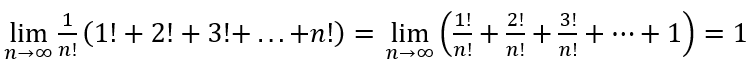
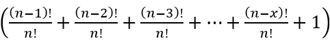
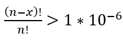

### Explanation

Because of this equation:\ 
\
the problem can be solved without full calculation of all factorials.\
\
To calculate initial value there is enough to take sum of\
\
where x enough high to fit\

